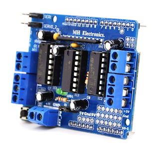

# The Shop Rover - Parts List

This is the list of components required for building The Shop Rover, a four-wheel drive robot car designed for simple shopping tasks, controlled via a smartphone.

### 1. **Châssis de Voiture Robot 4 Roues Motrices (Kit Arduino)**
   - **Description**: The fundamental structure of the robot, typically provided as a kit for easy integration with Arduino. This four-wheel drive chassis offers good maneuverability and sufficient payload capacity for the onboard components.
   - **Components Typically Included**:
     - **Base Platform**: The main structure to which motors and electronics are attached.
     - **Screws and Fasteners**: Necessary for assembling the motors, supports, and other elements to the chassis.
     - **Battery Holder**: Designed to securely accommodate the power source.
     - **Four Wheels with Tires**: Providing traction and enabling the robot's movement.
     - **Four DC Motors**: Supplying the driving force to the wheels.
     - **DC Motor Mounts**: Allowing the motors to be firmly attached to the chassis.
   - **Role in Project**: Provides the physical foundation for all other components and enables the robot to move.
   - **Example Kit**: Dagu 4WD Smart Robot Car Chassis Kit. A 3D model of a similar kit can be viewed here: [https://grabcad.com/library/arduino-4wd-buggy-kit-1](https://grabcad.com/library/arduino-4wd-buggy-kit-1)
   - **Material**: Usually made of plastic, acrylic wood, or aluminum, balancing lightness and robustness.
   - **Image**:
     

       
     

### 2. **Carte Arduino Uno R3**
   - **Description**: A popular and user-friendly microcontroller board based on the ATmega328P chip. It serves as the robot's "brain."
   - **Features**:
     - 16 MHz clock speed
     - 14 digital input/output pins
     - 6 analog inputs
     - USB connection for programming
     - 32 KB flash memory for storing code
   - **Role in Project**: Executes the code written to control the motors, read sensor data (photoresistor), and interact with other modules (Bluetooth, buzzer, LEDs). It receives commands from the smartphone via Bluetooth and acts accordingly.
   - **Programming Language**: C++ using the Arduino IDE.
   - **Image**:
     

       
     

### 3. **Module Bluetooth HC-05**
   - **Description**: A wireless communication module utilizing Bluetooth technology. It allows establishing a wireless serial connection between the Arduino and a smartphone or other Bluetooth-enabled device.
   - **Function**: Enables the smartphone to send commands to the robot (e.g., move forward, backward, turn) and potentially receive data from the robot (if additional sensors are implemented).
   - **Role in Project**: Facilitates real-time control of the robot's movements via a mobile application.
   - **Configuration**: May require initial setup (name, password, communication speed) using AT commands.
   - **Image**:
     

       
     

### 4. **Driver de Moteur L293D**
   - **Description**: An integrated circuit (chip) designed to control DC motors. It contains two H-bridges, allowing independent control of the direction and speed of two motors.
   - **Function**: The Arduino cannot directly supply the power needed for the motors. The L293D acts as a power interface, taking low-current control signals from the Arduino and amplifying them to power the motors with the required current and voltage from the battery. It also allows for reversing the motors' rotation direction.
   - **Role in Project**: Controls the direction and speed of the robot's four DC motors based on signals from the Arduino.
   - **Alternative**: More powerful motor drivers like the L298N exist but the L293D is suitable for smaller robotics projects.
   - **Image**:
     

       
     

### 5. **Batterie Lithium INR18650 – 2000mAh**
   - **Quantity**: 1
   - **Description**: A type of rechargeable cylindrical lithium-ion battery commonly used in portable electronics. "INR" indicates its specific internal chemistry, optimized for a good balance between discharge current and capacity. 2000mAh represents its capacity, the amount of electrical charge it can store.
   - **Specifications**: 3.7V nominal voltage, 2000mAh capacity.
   - **Role in Project**: Provides the electrical power necessary for the entire robot circuit to operate (Arduino, motors, sensors, LEDs, buzzer).
   - **Important Note**: Lithium-ion batteries require specific handling and charging precautions (using a protection circuit and a compatible charger) to prevent risks of overheating, fire, or explosion.
   - **Image**:
     

       
     

### 6. **LED Blanches (x2)**
   - **Description**: Light Emitting Diodes (LEDs) that emit white light when an electric current passes through them.
   - **Function**: Can be used for robot illumination, indicating operational status, or creating visual effects.
   - **Role in Project**: Provides visual feedback or lighting for the robot.
   - **Connection**: Requires a series resistor to limit the current and prevent damage.
   - **Image**:
     

       
     

### 7. **Klaxon (Buzzer)**
   - **Description**: An electromechanical device that produces a sound when electrically powered.
   - **Function**: Allows the robot to emit audible signals to alert shopkeepers of its presence or indicate an action (e.g., "payment" made).
   - **Role in Project**: Provides an auditory signal for interaction in the shopping environment.
   - **Type**: Ensure compatibility with the Arduino's output voltage (typically 5V for active buzzers).
   - **Image**:
     

       
     

### 8. **Capteur à Ultrasons HC-SR04**
- **Description**: A distance measuring sensor that uses ultrasonic waves to detect obstacles and measure how far away they are.
- **Function**: Sends out an ultrasonic pulse and listens for its echo to calculate the distance to an object. Ideal for obstacle detection and avoidance.
- **Role in Project**: Allows the robot to detect obstacles in front of it and make decisions to avoid collisions while navigating.
- **Specifications**:
  - Operating Voltage: 5V DC
  - Measuring Range: 2 cm to 400 cm
  - Accuracy: ±3 mm
  - Trigger and Echo pins for communication
- **Connection**: Typically connects to two digital pins on the Arduino (Trigger and Echo), powered by 5V and GND.
- **Image**:
  

    
  

---

### Notes:
- Ensure all components are compatible with each other's voltage and current requirements.
- This list provides the core components for the Shop Rover project. Additional sensors or modules could be added for more advanced functionalities in the future.
